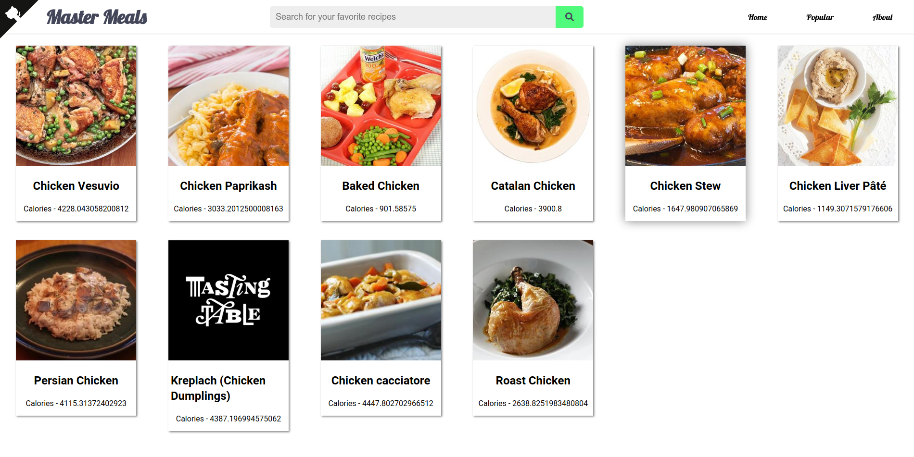

#  Master Meals

A recipe app created with ReactJS using the recipe API from edamam.com with features such as skeleton loading and a top loading bar.

Check out this project hosted on github pages : [https://maryll-castelino.github.io/master-meals/](https://maryll-castelino.github.io/master-meals/)

